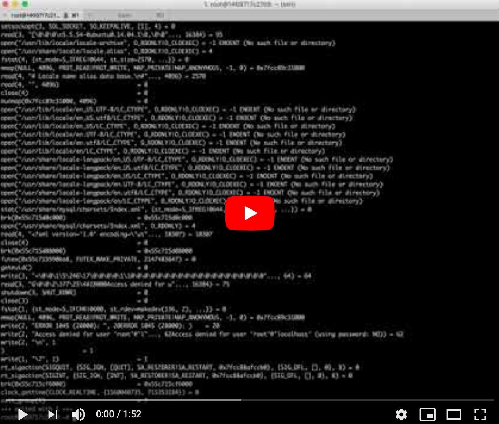

# Web stack debugging #3 challenge
When debugging, sometimes logs are not enough. Either because the software is
breaking in a way that was not expected and the error is not being logged, or
because logs are not providing enough information. In this case it is needed
to go down the stack.

Wordpress is a very popular tool, it allows you to run blogs, portfolios,
e-commerce and company websites It actually powers 26% of the web, so there is
a fair chance that you will end up working with it at some point in your career.

Wordpress is usually run on LAMP (Linux, Apache, MySQL, and PHP), which is a
very widely used set of tools.

## Topics
- Linux
- Apache
- MySQL
- PHP
- Ruby
- Wordpress
- puppet
- puppet-lint
- strace

## Context
{height="50%" width="50%"}


  
## Requirementes
- Linux Ubuntu 14.04 LTS
- Ruby (version ruby 1.9.x)
- puppet-lint (version 2.1.1)

## Challenges

###  0. Strace is your friend
[](https://youtu.be/uHEzt1QuASo)

Using strace, find out why Apache is returning a 500 error. Once you find the
issue, fix it and then automate it using Puppet (instead of using Bash as you
were previously doing).

**Example**
```bash wrap
root@e514b399d69d:~# curl -sI 127.0.0.1
HTTP/1.0 500 Internal Server Error
Date: Fri, 24 Mar 2017 07:32:16 GMT
Server: Apache/2.4.7 (Ubuntu)
X-Powered-By: PHP/5.5.9-1ubuntu4.21
Connection: close
Content-Type: text/html

root@e514b399d69d:~# puppet apply 0-strace_is_your_friend.pp
Notice: Compiled catalog for e514b399d69d.ec2.internal in environment production in 0.02 seconds
Notice: /Stage[main]/Main/Exec[fix-wordpress]/returns: executed successfully
Notice: Finished catalog run in 0.08 seconds
root@e514b399d69d:~# curl -sI 127.0.0.1:80
root@e514b399d69d:~#
HTTP/1.1 200 OK
Date: Fri, 24 Mar 2017 07:11:52 GMT
Server: Apache/2.4.7 (Ubuntu)
X-Powered-By: PHP/5.5.9-1ubuntu4.21
Link: <http://127.0.0.1/?rest_route=/>; rel="https://api.w.org/"
Content-Type: text/html; charset=UTF-8

root@e514b399d69d:~# curl -s 127.0.0.1:80 | grep Holberton
<title>Holberton &#8211; Just another WordPress site</title>
<link rel="alternate" type="application/rss+xml" title="Holberton &raquo; Feed" href="http://127.0.0.1/?feed=rss2" />
<link rel="alternate" type="application/rss+xml" title="Holberton &raquo; Comments Feed" href="http://127.0.0.1/?feed=comments-rss2" />
        <div id="wp-custom-header" class="wp-custom-header"></div>  </div>
                            <h1 class="site-title"><a href="http://127.0.0.1/" rel="home">Holberton</a></h1>
        <p>Yet another bug by a Holberton student</p>
root@e514b399d69d:~#
```

## Author
Gonzalo Gomez Millan | :octocat: 
